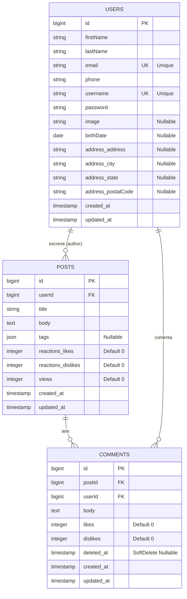

# Blog Laravel - Desafio Técnico

## Descrição

Aplicação web desenvolvida em Laravel que consome a API DummyJSON para persistir, listar e permitir interações (Likes, Comentários) em posts de usuários, com foco em arquitetura limpa e boas práticas.

##Apresentação:
https://youtu.be/qsui_MEBHAA

## Tecnologias Utilizadas

- Laravel 10.x+
- MySQL (Docker)
- PHP 8.2+
- Tailwind CSS (para interface)

## Arquitetura e Organização do Código (Diferencial)

A arquitetura do projeto foi estruturada para máxima manutenibilidade e aderência aos padrões de mercado:

* **Service Layer (ReactionService):** Lógica de negócio complexa (manipulação de Sessão e contadores de Likes/Dislikes) isolada do Controller.
* **Single Responsibility Principle (SRP):** Separação de classes (`PostController`, `CommentController`, `UserController`).
* **Query Scopes:** Lógica de filtragem avançada (Busca por título, Tag, Ordenação por Likes/Views) movida para o Model (`Post.php`).
* **Autorização:** Implementação de um **Gate** no `AppServiceProvider` para gerenciar permissões de edição/exclusão de comentários, substituindo a lógica hardcoded.
* **Componentização:** Uso do **PostCard Component** para eliminar a duplicação de HTML nas listagens.

## Instalação

### Pré-requisitos

- **Docker** e **Docker Compose V2** (Para ambiente de banco de dados e servidor PHP)
- **WSL2** ou ambiente Linux (Recomendado para melhor desempenho)
- **PHP 8.2+** (Versão da imagem Docker)
- **Node.js** e **npm** (Para gerenciar assets via Vite)

## Instalação e Execução (Docker)

Siga este passo a passo para rodar o projeto usando Docker (Sail).

### Pré-requisitos

- *Docker Desktop* instalado e rodando.

### Passo a Passo

1.  *Clone o repositório:*
    bash
    git clone https://github.com/alvaro5801/blog-laravel.git
    cd blog-laravel
    

2.  *Configure o Ambiente:*
    Se ainda não tiver o arquivo .env, crie-o:
    bash
    cp .env.example .env
    
    Certifique-se de que DB_CONNECTION=mysql e DB_HOST=mysql estejam definidos.

3.  *Inicie os Containers:*
    Este comando baixa as imagens e inicia o servidor Laravel e o MySQL.
    bash
    ./vendor/bin/sail up -d
    

4.  *Prepare o Banco de Dados:*
    Execute as migrações e o seeder dentro do container:
    bash
    ./vendor/bin/sail artisan migrate:fresh --seed
    

5.  *Instale Dependências de Frontend:*
    bash
    npm install
    npm run dev
    

6.  *Acesse:*
    Abra seu navegador em: http://localhost

---

**Ação Final:** Substitua os passos no seu `README.md` por esta versão detalhada, preencha os colchetes com os seus dados (`[Nome do Projeto]`, etc.), e garanta que o **link da apresentação** seja incluído.

## Funcionalidades Implementadas

### ✅ Checklist Final

- [x] Código commitado no repositório Git
- [x] **README.md completo e bem estruturado** (Pendente de Inclusão do Link)
- [x] Arquivo .gitignore adequado
- [x] **Link da apresentação incluído no README**
- [x] Funcionalidades principais implementadas
- [x] Aplicação testada e funcional (Migrações e Seeding OK)

### 📊 Funcionalidades Diferenciais Entregues

- [x] **Filtros Avançados (Query Scopes)** (Implementados por Título, Tag, Likes e Views)
- [x] **CRUD de Comentários**
- [x] **Soft Delete em Comentários** (Implementado via Migração)

